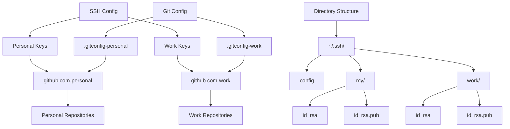

# Git SSH Key Management Guide

This guide explains the new SSH key management system for Git, which provides a more maintainable and secure way to handle multiple Git identities.

## Table of Contents

1. [System Overview](#system-overview)
2. [Directory Structure](#directory-structure)
3. [Configuration Files](#configuration-files)
4. [Setup Guide](#setup-guide)
5. [Usage Examples](#usage-examples)
6. [Security Features](#security-features)
7. [Advanced Configuration](#advanced-configuration)

## System Overview

### System Architecture



The new key management system uses SSH's built-in configuration features to:
- Manage multiple SSH keys for different Git services
- Keep keys organized and secure
- Provide clear identity separation
- Enable easy key rotation and management

### Key Benefits

- **Organized**: Each key has a dedicated purpose and location
- **Secure**: Uses SSH's security features like `IdentitiesOnly`
- **Maintainable**: Standard SSH configuration makes updates easy
- **Flexible**: Supports multiple Git hosts and accounts

## Directory Structure

```plaintext
~/.ssh/
├── config                 # Main SSH configuration file
├── my/                   # Personal keys directory
│   ├── id_rsa           # Personal private key
│   └── id_rsa.pub       # Personal public key
├── work/                # Work keys directory
│   ├── id_rsa           # Work private key
│   └── id_rsa.pub       # Work public key
└── config.d/            # Additional config files (optional)
    ├── personal.conf    # Personal-specific settings
    └── work.conf        # Work-specific settings
```

## Configuration Files

### 1. SSH Config (`~/.ssh/config`)

```ssh-config
# Default settings
Host *
    AddKeysToAgent yes
    UseKeychain yes
    IdentitiesOnly yes

# Personal GitHub
Host github.com-personal
    HostName github.com
    User git
    IdentityFile ~/.ssh/my/id_rsa
    IdentitiesOnly yes

# Work GitHub
Host github.com-work
    HostName github.com
    User git
    IdentityFile ~/.ssh/work/id_rsa
    IdentitiesOnly yes
```

### 2. Git Configurations

```ini
# ~/.gitconfig-personal
[user]
    name = Your Personal Name
    email = your.personal@email.com
[core]
    sshCommand = "ssh -F ~/.ssh/config -i ~/.ssh/my/id_rsa"

# ~/.gitconfig-work
[user]
    name = Your Work Name
    email = your.work@company.com
[core]
    sshCommand = "ssh -F ~/.ssh/config -i ~/.ssh/work/id_rsa"
```

## Setup Guide

1. **Generate SSH Keys**:
   ```bash
   # Personal key
   ssh-keygen -t rsa -b 4096 -f ~/.ssh/my/id_rsa -C "personal@email.com"

   # Work key
   ssh-keygen -t rsa -b 4096 -f ~/.ssh/work/id_rsa -C "work@email.com"
   ```

2. **Set Permissions**:
   ```bash
   # Set directory permissions
   chmod 700 ~/.ssh
   chmod 700 ~/.ssh/my
   chmod 700 ~/.ssh/work

   # Set file permissions
   chmod 600 ~/.ssh/config
   chmod 600 ~/.ssh/my/id_rsa
   chmod 600 ~/.ssh/work/id_rsa
   ```

3. **Run Setup Script**:
   ```bash
   ./ssh-config/setup-git-config.sh
   ```

4. **Add Keys to Git Services**:
   ```bash
   # Display public keys
   cat ~/.ssh/my/id_rsa.pub    # Add to personal GitHub
   cat ~/.ssh/work/id_rsa.pub  # Add to work GitHub
   ```

## Usage Examples

### 1. Repository Operations

```bash
# Clone repositories
git clone git@github.com-personal:username/repo.git
git clone git@github.com-work:username/repo.git

# Update existing repository remote
git remote set-url origin git@github.com-personal:username/repo.git

# Push to specific remote
git push git@github.com-work:username/repo.git main
```

### 2. Testing Connections

```bash
# Test personal connection
ssh -T git@github.com-personal

# Test work connection
ssh -T git@github.com-work

# Debug connection issues
ssh -Tv git@github.com-personal
```

### 3. Managing Multiple Repositories

```bash
# Set repository-specific configuration
git config user.email "work@company.com"
git config core.sshCommand "ssh -F ~/.ssh/config -i ~/.ssh/work/id_rsa"

# Create new repository with specific identity
git init
git config user.email "personal@email.com"
git remote add origin git@github.com-personal:username/repo.git
```

## Security Features

### 1. Identity Isolation

The system uses `IdentitiesOnly yes` to ensure:
- Only specified keys are used for each host
- No unintended key usage
- Clear audit trail

### 2. Key Protection

```bash
# Set correct permissions
chmod 600 ~/.ssh/*/id_rsa*

# Use SSH agent for key management
ssh-add -l                    # List loaded keys
ssh-add ~/.ssh/my/id_rsa     # Add specific key
ssh-add -D                    # Clear all keys
```

### 3. Configuration Security

```bash
# Verify SSH configuration
ssh -G github.com-personal

# Check effective Git configuration
git config --list --show-origin
```

## Advanced Configuration

### 1. Multiple Git Hosts

```ssh-config
# GitLab configuration
Host gitlab.com-personal
    HostName gitlab.com
    User git
    IdentityFile ~/.ssh/gitlab/id_rsa
    IdentitiesOnly yes

# Azure DevOps configuration
Host ssh.dev.azure.com-work
    HostName ssh.dev.azure.com
    User git
    IdentityFile ~/.ssh/azure/id_rsa
    IdentitiesOnly yes
```

### 2. Per-Directory Configuration

```ini
# ~/.gitconfig
[includeIf "gitdir:~/work/"]
    path = ~/.gitconfig-work
[includeIf "gitdir:~/personal/"]
    path = ~/.gitconfig-personal
```

### 3. Key Rotation

1. Generate new key:
   ```bash
   ssh-keygen -t rsa -b 4096 -f ~/.ssh/my/id_rsa_new -C "personal@email.com"
   ```

2. Update configuration:
   ```ssh-config
   Host github.com-personal
       IdentityFile ~/.ssh/my/id_rsa_new
   ```

3. Add new key to services and test:
   ```bash
   cat ~/.ssh/my/id_rsa_new.pub  # Add to GitHub
   ssh -T git@github.com-personal # Test connection
   ```

4. Remove old key after confirming new key works:
   ```bash
   rm ~/.ssh/my/id_rsa*  # Remove old key
   ```

### 4. Debugging Tools

```bash
# Test SSH configuration
ssh -Tv git@github.com-personal

# Show effective SSH configuration
ssh -G github.com-personal

# Check Git remote configuration
git remote -v

# Verify Git operations
GIT_SSH_COMMAND="ssh -v" git fetch
```
